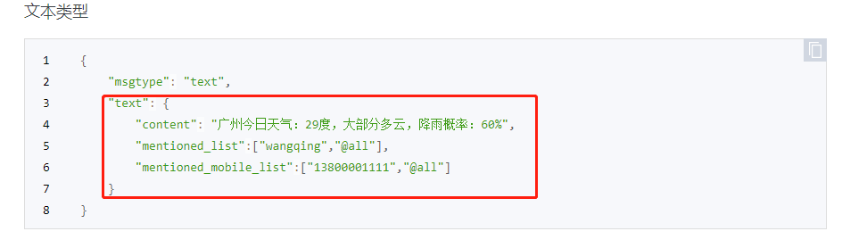
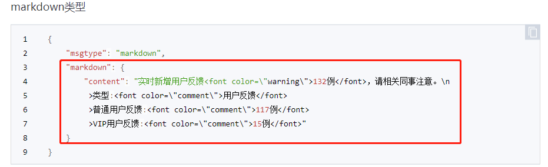
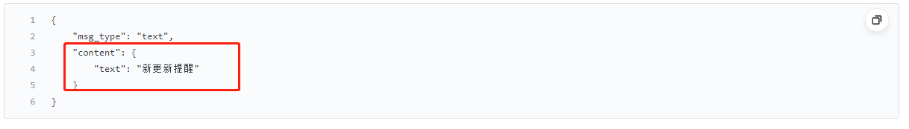
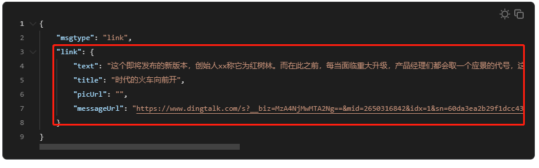

# Messenger

messenger是一个简单轻量的消息发送服务，支持邮件、微信、飞书、钉钉，同时支持配置动态修改，使用简单灵活

## 使用方式

### 源码
```bash
cd messenger
sh build.sh
cp confTemplate.yaml conf.yaml # edit your config
./messenger
```

### docker
```bash
cd messenger
cp confTemplate.yaml conf.yaml # edit your config
docker build --tag messenger .
docker run --name messenger -p 8888:8888  messenger 
```

## API

<table>
    <tr>
        <td>参数</td>
        <td>是否必须</td>
        <td>描述</td>
    </tr>
    <tr>
        <td >sender</td>
        <td>是</td>
        <td>发送消息具体sender的名称，对应conf中的name</td>
    </tr>
    <tr>
        <td >title</td>
        <td>否</td>
        <td>消息标题，仅用于 email 类型</td>
    </tr>
    <tr>
        <td>msgtype</td>
        <td>是</td>
        <td>
          <table>
            <tr><td>消息类型</td><td>参考值</td></tr>
            <tr><td>email</td><td>text/plain text/html</td></tr>
            <tr><td>wechatBot</td><td><a href=https://developer.work.weixin.qq.com/document/path/99110#%E6%B6%88%E6%81%AF%E7%B1%BB%E5%9E%8B%E5%8F%8A%E6%95%B0%E6%8D%AE%E6%A0%BC%E5%BC%8F>https://developer.work.weixin.qq.com/document/path/99110#%E6%B6%88%E6%81%AF%E7%B1%BB%E5%9E%8B%E5%8F%8A%E6%95%B0%E6%8D%AE%E6%A0%BC%E5%BC%8F</a></td></tr>
            <tr><td>wechatApp</td><td><a href=https://developer.work.weixin.qq.com/document/path/90236#%E6%B6%88%E6%81%AF%E7%B1%BB%E5%9E%8B>https://developer.work.weixin.qq.com/document/path/90236#%E6%B6%88%E6%81%AF%E7%B1%BB%E5%9E%8B</a></td></tr>
            <tr><td>feishuBot</td><td><a href=https://open.feishu.cn/document/client-docs/bot-v3/add-custom-bot#5a997364>https://open.feishu.cn/document/client-docs/bot-v3/add-custom-bot#5a997364</a></td></tr>
            <tr><td>feishuApp</td><td><a href=https://open.feishu.cn/document/server-docs/im-v1/message-content-description/create_json#3c92befd>https://open.feishu.cn/document/server-docs/im-v1/message-content-description/create_json#3c92befd</a></td></tr>
            <tr><td>dingdingBot</td><td><a href=https://open.dingtalk.com/document/orgapp/custom-robot-access#title-72m-8ag-pqw>https://open.dingtalk.com/document/orgapp/custom-robot-access#title-72m-8ag-pqw</a></td></tr>
            <tr><td>dingdingApp</td><td><a href=https://open.dingtalk.com/document/orgapp/types-of-messages-sent-by-robots?spm>https://open.dingtalk.com/document/orgapp/types-of-messages-sent-by-robots?spm</a></td></tr>
          </table>
        </td>
    </tr>
    <tr>
        <td >content</td>
        <td>是</td>
        <td>消息内容</td>
    </tr>
    <tr>
        <td >tos</td>
        <td>否</td>
        <td>接收人，发送应用消息时需要填写</td>
    </tr>
</table>

> 微信，飞书，钉钉发送消息均分为机器人和应用两类（参数传递时，应用消息相比机器人需要多传递tos--接收人列表），以wechatBot发送为例，消息发送代码参考如下
>
> 注意：content为最终的内容
> <br>
> 
> <br>
> 如微信text，将text的值对象`{"content": "广州今日天气..."}`做为content的值填入
> <br>
> 
> <br>
> 再如微信markdown，将markdown的值对象`{"content": "实时新增用户反馈..."}`做为content的值填入
> <br>
> 
> <br>
> 再如飞书text消息，将content的值对象`{"text": "新更新提醒"}`做为content的值填入
> <br>
> 
> <br>
> 再如钉钉link消息，将link的值对象`{"text": "这个即将发布的新版本...","title":"","picUrl":"","messageUrl":""}`做为content的值填入

以下为一些代码示例

### curl
```bash
curl  -X POST \
  'http://localhost:8888/v1/message' \
  --header 'Content-Type: application/json' \
  --data-raw '{
  "sender": "wechatBot",
  "msgtype": "text",
  "content": {
    "content": "广州今日天气"
  }
}'
```

### python
```python
import requests
import json

reqUrl = "http://localhost:8888/v1/message"

headersList = {
 "Content-Type": "application/json" 
}

payload = json.dumps({
  "sender": "wechatBot",
  "msgtype": "text",
  "content": {
    "content": "一行文本内容"
  }
})

response = requests.request("POST", reqUrl, data=payload,  headers=headersList)

print(response.text)
```

### golang
```golang
package main

import (
	"fmt"
	"strings"
	"net/http"
	"io/ioutil"
)

func main() {

	url := "http://localhost:8888/v1/message"

	payload := strings.NewReader("{\n  \"sender\": \"wechatBot\",\n  \"msgtype\": \"text\",\n  \"content\": {\n    \"content\": \"一行文本内容\"\n  }\n}")

	req, _ := http.NewRequest("POST", url, payload)

	req.Header.Add("Content-Type", "application/json")

	res, _ := http.DefaultClient.Do(req)

	defer res.Body.Close()
	body, _ := ioutil.ReadAll(res.Body)

	fmt.Println(res)
	fmt.Println(string(body))

}
```

## yaml 配置

yaml配置文件定义了服务ip的、端口和各个具体的sender。senders支持动态增删，即再服务已经启动的情况下可以直接修改senders列表，服务会持续读取最新的改动

目前以支持sender类型
1. email
2. wechatBot
3. wechatApp
4. feishuBot
5. feishuApp
6. dingdingBot
7. dingdingApp

```yaml
app:
  ip:
  port: 8888

senders:
  - type: email
    name: email
    host: mail.xxx.com
    port: 25
    account: test@xxx.com
    password: #无密码时留空即可
  - type: wechatBot
    name: wechatBot
    url: https://qyapi.weixin.qq.com/cgi-bin/webhook/send?key=xxxxx
  - type: wechatApp
    name: wechatApp
    corpID: xxxx
    agentID: 123456
    corpSecret: xxxx
  - type: feishuBot
    name: feishuBot
    url: https://open.feishu.cn/open-apis/bot/v2/hook/xxxxxx
  - type: feishuApp
    name: feishuApp
    appID: cli_xxxx
    appSecret: xxxx
  - type: dingdingBot
    name: dingdingBot
    url: https://oapi.dingding.com/robot/send?access_token=xxxx
    token: xxxx #仅加密方式为加签时填写
  - type: dingdingApp
    name: dingdingApp
    appKey: xxxx
    appSecret: xxxx
    robotCode: xxxx
```

## 新增发送方式

通常情况下，以上7中方式能满足大部分需求，但是如果你想要定制自己的sender，可以按如下步骤进行开发

1. 再send目录下创建你的sender文件，如mysender.go
2. 定义mysender类并实现sender接口
   ```golang
   type sender interface {
	   send(*message) error
	   getConf() map[string]string
   }
   ```
3. 新增init方法将你的sender注册到后台goroutine中，registered的key mysender即为你的sender的类型，可以在配置文件中使用。通常建议将文件名、结构体名、类型名保持一直
   ```golang
   func init() {
	   registered["mysender"] = func(conf map[string]string) sender {
	   return &feishuBot{conf: conf}
	  }
   }
   ```